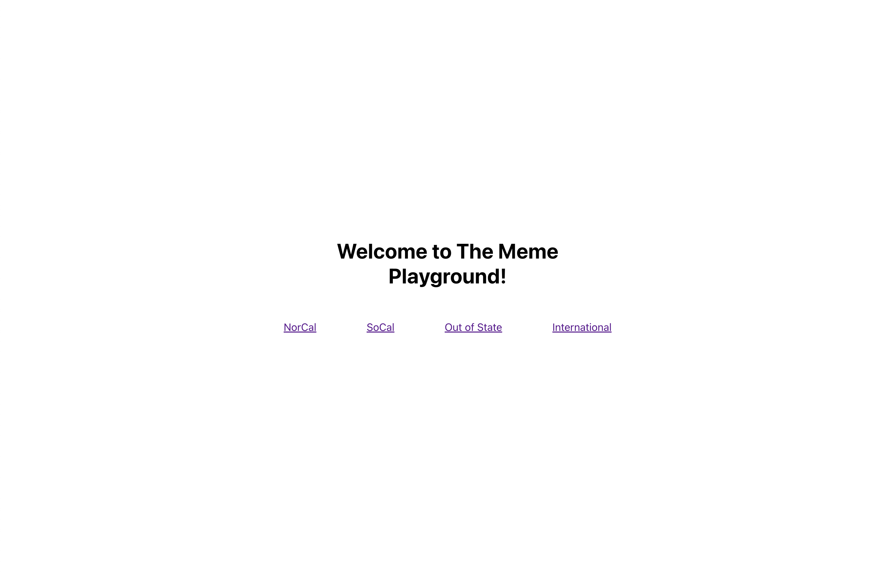

# The Git Meme Playground Activity

## Introduction
Hi everyone! Welcome to the Meme Playground. This is a barebones web application that you can use to test your knowledge of Git and reinforce the things we mentioned in the workshop. You'll need to clone this repository, make changes, push them, and leave a permanent mark on the website. We have a room of people all trying to make changes at the same time. You'll get to see version control working in real time!

## How It Will Work
Here's how it will work. Each attendee belongs to 1 of 4 groups: **Norcal, Socal, Out-of-State, and International**, depending on where you're originally from. You all must upload your favorite meme at the moment to the website. Each group has their own page, so the meme you upload will represent your entire group / team. You want your region to put its best foot forward, so try your best to pick a good meme!

There is a home screen (shown below) with outgoing links that will take you to each group's page.

Any changes you make (memes you add) will show up on the pages accessible through these links.

## Setup
1. Clone this repository onto your machine by running the `git clone` command as presented in the workshop.

Now the repository is ready for you to make changes.

## Instructions for Adding a Meme
1. Find your favorite meme and download it to your computer (.png, .jpeg, and .webp formats are all okay).
2. Name the image file something descriptive.
3. Run `git pull` to ensure that your local repo is up to date.
4. Drag the image into the folder /git-meme-playground/playground/src/memes/meme-images.
5. Open the /git-meme-playground/playground/src/memes/memes.js and import the image with a line like `import [unique-name] from ./meme-images/[file-name]`.
6. Scroll down in the file memes.js and add the meme (referencing it with the name you gave it when importing) to the appropriate array. (there are four arrays named norcalMemes, socalMemes, outOfStateMemes, and internationalMemes).
7. Run `git add .`
8. Run `git commit -m`, followed by a message, to commit your changes.
9. Run `git push` to push your changes to GitHub.
